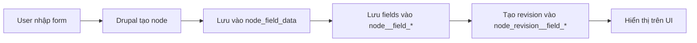
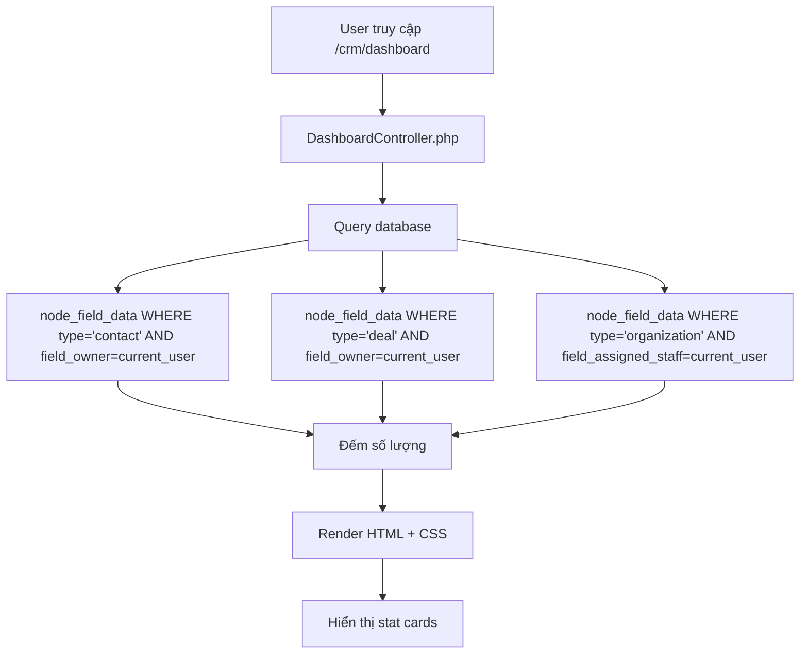

# 📊 CẤU TRÚC LƯU TRỮ DỮ LIỆU - Open CRM

## 🗄️ **1. DATABASE - Nơi Lưu Trữ Dữ Liệu**

### **Thông Tin Database**

```
Database Name: db
Database Type: MariaDB 11.8 (MySQL-compatible)
Host: db (Docker container)
Port: 3306 -> 127.0.0.1:58191
Username/Password: db/db hoặc root/root
```

### **Kết Nối Từ Ngoài**

```bash
# Từ máy host (macOS)
mysql -h 127.0.0.1 -P 58191 -u db -pdb db

# Hoặc dùng DDEV
ddev mysql
```

---

## 📦 **2. CẤU TRÚC DỮ LIỆU - Content Types**

Hệ thống CRM lưu dữ liệu qua **5 loại nội dung chính**:

| Content Type     | Số Lượng   | Mô Tả                                 |
| ---------------- | ---------- | ------------------------------------- |
| **Activity**     | 24 records | Hoạt động (cuộc họp, gọi điện, email) |
| **Contact**      | 23 records | Liên hệ (người liên lạc)              |
| **Organization** | 19 records | Tổ chức/Công ty                       |
| **Deal**         | 14 records | Giao dịch/Cơ hội kinh doanh           |
| **Page**         | 2 records  | Trang nội dung tĩnh                   |

---

## 🗂️ **3. BẢNG DATABASE QUAN TRỌNG**

### **A. Bảng Chính (Core Tables)**

#### **`node_field_data`** - Bảng Lưu Toàn Bộ Nội Dung

```sql
-- Cấu trúc
nid       INT         # Node ID (ID duy nhất)
type      VARCHAR     # Loại: activity, contact, deal, organization
title     VARCHAR     # Tiêu đề/Tên
uid       INT         # User ID (người tạo)
status    TINYINT     # 1=Published, 0=Unpublished
created   INT         # Timestamp tạo
changed   INT         # Timestamp cập nhật
```

**Ví dụ dữ liệu:**

```sql
+-----+--------------+---------------------+-----+
| nid | type         | title               | uid |
+-----+--------------+---------------------+-----+
|   2 | organization | Global Enterprises  |   0 |
|   3 | organization | Tech Solutions Inc  |   0 |
|   5 | contact      | Sarah Johnson       |   0 |
|   6 | contact      | Mike Davis          |   0 |
+-----+--------------+---------------------+-----+
```

#### **`node`** - Bảng Metadata Gốc

- Lưu thông tin cơ bản về từng node
- Tổng: **81 nodes**

#### **`node_revision`** - Lịch Sử Phiên Bản

- Theo dõi mọi thay đổi của node
- Tổng: **82 revisions**

---

### **B. Bảng Trường Dữ Liệu (Field Tables)**

Mỗi trường (field) có **2 bảng riêng**:

1. `node__field_*` - Dữ liệu hiện tại
2. `node_revision__field_*` - Lịch sử dữ liệu

#### **Các Trường Quan Trọng:**

| Bảng                         | Số Dòng | Mục Đích                     |
| ---------------------------- | ------- | ---------------------------- |
| `node__field_owner`          | 39      | Người sở hữu (CRM Owner)     |
| `node__field_status`         | 33      | Trạng thái (Active/Inactive) |
| `node__field_contact`        | 31      | Liên kết Contact             |
| `node__field_phone`          | 24      | Số điện thoại                |
| `node__field_email`          | 24      | Email                        |
| `node__field_position`       | 23      | Vị trí/Chức vụ               |
| `node__field_organization`   | -       | Liên kết Organization        |
| `node__field_amount`         | -       | Giá trị Deal                 |
| `node__field_stage`          | -       | Giai đoạn Deal               |
| `node__field_assigned_to`    | -       | Người được giao              |
| `node__field_assigned_staff` | -       | Nhân viên phụ trách          |

**Ví dụ cấu trúc bảng trường:**

```sql
-- node__field_email
entity_id    INT        # Node ID
field_email_value  VARCHAR   # Giá trị email
```

---

### **C. Bảng Người Dùng (User Tables)**

| Bảng                 | Mô Tả                                   |
| -------------------- | --------------------------------------- |
| `users`              | Thông tin người dùng cơ bản             |
| `users_field_data`   | Dữ liệu người dùng (name, mail, status) |
| `users_data`         | Dữ liệu bổ sung                         |
| `user__user_picture` | Avatar người dùng                       |
| `user__roles`        | Vai trò (Sales Manager, Sales Rep)      |

---

## 🔄 **4. CÁCH DỮ LIỆU HOẠT ĐỘNG**

### **A. Khi Tạo Contact Mới**



**Chi tiết:**

1. User click "Add Contact" → Form xuất hiện
2. User điền: Name, Email, Phone, Organization
3. Submit → Drupal tạo:
   - 1 dòng trong `node_field_data` (type='contact')
   - 1 dòng trong `node__field_email`
   - 1 dòng trong `node__field_phone`
   - 1 dòng trong `node__field_organization`
   - 1 dòng trong `node__field_owner` (user hiện tại)
4. Data được cache và hiển thị trong view

---

### **B. Khi Xem Dashboard**



**Query Thực Tế:**

```php
// Đếm contacts
$query = \Drupal::entityQuery('node')
  ->condition('type', 'contact')
  ->condition('field_owner', $current_user->id())
  ->condition('status', 1)
  ->accessCheck(FALSE);
$count = $query->count()->execute();
```

---

### **C. Phân Quyền Dữ Liệu (Data Isolation)**

**Module:** `web/modules/custom/crm/crm.module`

**Hooks sử dụng:**

```php
// 1. Kiểm tra quyền truy cập node
function crm_node_access(NodeInterface $node, $op, AccountInterface $account) {
  // Kiểm tra field_owner, field_assigned_to, field_assigned_staff
  // Chỉ cho phép user xem/sửa data của họ
}

// 2. Lọc query kết quả
function crm_query_node_access_alter(AlterableInterface $query) {
  // Tự động thêm WHERE clause:
  // WHERE field_owner = current_user_id
  // OR field_assigned_to = current_user_id
}
```

**Kết quả:**

- User **manager** chỉ thấy contacts/deals của họ
- User **admin** thấy tất cả (bypass permission)
- Sales Manager thấy data của team họ quản lý

---

## 📂 **5. NƠI LƯU FILES/UPLOADS**

### **Thư Mục Files**

```
web/sites/default/files/
├── user-pictures/          # Avatar người dùng
├── contact-avatars/        # Avatar contacts
├── organization-logos/     # Logo công ty
├── contracts/              # File hợp đồng
└── import/                 # CSV imports
```

### **Bảng Database Cho Files**

| Bảng                 | Mô Tả                                 |
| -------------------- | ------------------------------------- |
| `file_managed`       | Metadata của files (path, size, mime) |
| `file_usage`         | File được dùng ở đâu (node, user)     |
| `node__field_avatar` | Liên kết contact → avatar file        |
| `node__field_logo`   | Liên kết org → logo file              |
| `user__user_picture` | Liên kết user → avatar file           |

**Cấu trúc:**

```sql
-- file_managed
fid       INT         # File ID
uid       INT         # User upload
filename  VARCHAR     # Tên file
uri       VARCHAR     # public://user-pictures/image.jpg
filemime  VARCHAR     # image/jpeg
filesize  INT         # Kích thước bytes
status    TINYINT     # 1=Permanent, 0=Temporary
created   INT         # Timestamp

-- file_usage
fid       INT         # File ID
module    VARCHAR     # 'node', 'user'
type      VARCHAR     # 'node', 'user'
id        INT         # Node ID hoặc User ID
count     INT         # Số lần sử dụng
```

---

## 🔍 **6. CÁCH TRA CỨU DỮ LIỆU**

### **A. Xem Tất Cả Contacts**

```sql
ddev mysql -e "
SELECT
  n.nid,
  n.title AS name,
  e.field_email_value AS email,
  p.field_phone_value AS phone,
  o.field_owner_target_id AS owner_uid
FROM node_field_data n
LEFT JOIN node__field_email e ON n.nid = e.entity_id
LEFT JOIN node__field_phone p ON n.nid = p.entity_id
LEFT JOIN node__field_owner o ON n.nid = o.entity_id
WHERE n.type = 'contact'
AND n.status = 1
" db
```

### **B. Xem Deals Của User**

```sql
ddev mysql -e "
SELECT
  n.nid,
  n.title AS deal_name,
  a.field_amount_value AS amount,
  s.field_stage_value AS stage,
  o.field_owner_target_id AS owner
FROM node_field_data n
LEFT JOIN node__field_amount a ON n.nid = a.entity_id
LEFT JOIN node__field_stage s ON n.nid = s.entity_id
LEFT JOIN node__field_owner o ON n.nid = o.entity_id
WHERE n.type = 'deal'
AND o.field_owner_target_id = 2  -- User ID
" db
```

### **C. Đếm Data Theo Loại**

```sql
ddev mysql -e "
SELECT
  type,
  COUNT(*) as total,
  SUM(CASE WHEN status = 1 THEN 1 ELSE 0 END) as published
FROM node_field_data
GROUP BY type
" db
```

---

## 🎯 **7. CUSTOM MODULES - Logic Xử Lý**

### **Các Module CRM Custom**

| Module                | Chức Năng                                 |
| --------------------- | ----------------------------------------- |
| **crm**               | Core CRM - Access control, data filtering |
| **crm_dashboard**     | Dashboard với stat cards                  |
| **crm_kanban**        | Pipeline view (Kanban board)              |
| **crm_contact360**    | Contact detail page với timeline          |
| **crm_activity_log**  | Activity tracking                         |
| **crm_actions**       | Bulk actions (export, delete)             |
| **crm_import**        | CSV import contacts/organizations         |
| **crm_quickadd**      | Quick add forms (modal)                   |
| **crm_notifications** | Email/notification system                 |
| **crm_teams**         | Team management                           |

**Vị trí:** `web/modules/custom/`

---

## 🔧 **8. CÁCH BACKUP/RESTORE DỮ LIỆU**

### **Backup Database**

```bash
# Full backup
ddev export-db --file=backup-$(date +%Y%m%d).sql.gz

# Hoặc
ddev mysql db < /dev/null | gzip > backup.sql.gz
```

### **Restore Database**

```bash
# Restore
ddev import-db --src=backup.sql.gz

# Hoặc
gunzip < backup.sql.gz | ddev mysql db
```

### **Backup Files**

```bash
# Backup files directory
tar -czf files-backup-$(date +%Y%m%d).tar.gz web/sites/default/files/

# Restore
tar -xzf files-backup.tar.gz -C web/sites/default/
```

### **Full Site Backup (Gồm cả code)**

```bash
# Snapshot toàn bộ
ddev snapshot

# List snapshots
ddev snapshot --list

# Restore snapshot
ddev snapshot --name=snapshot-name
```

---

## 📊 **9. MONITORING & STATISTICS**

### **Xem Dung Lượng Database**

```sql
ddev mysql -e "
SELECT
  table_name,
  ROUND((data_length + index_length) / 1024 / 1024, 2) AS size_mb,
  table_rows
FROM information_schema.tables
WHERE table_schema = 'db'
AND table_name LIKE 'node%'
ORDER BY (data_length + index_length) DESC
LIMIT 20
" db
```

### **Performance Indexes**

```sql
-- Xem indexes hiện tại
ddev mysql -e "SHOW INDEX FROM node_field_data" db

-- Các indexes quan trọng:
-- - nid (Primary Key)
-- - type (Index để query nhanh)
-- - uid (Index cho owner queries)
-- - created (Index cho sorting)
-- - status (Index cho published/unpublished)
```

---

## 🎓 **10. TÓM TẮT LUỒNG DỮ LIỆU**

```
┌─────────────────────────────────────────────────────────────┐
│                    USER INTERACTION                          │
│  (Browser: http://open-crm.ddev.site)                       │
└────────────────────┬────────────────────────────────────────┘
                     │
                     ▼
┌─────────────────────────────────────────────────────────────┐
│                  DRUPAL 11 APPLICATION                       │
│  ┌───────────────┐  ┌──────────────┐  ┌─────────────────┐  │
│  │  Controllers  │  │  Modules     │  │  Views          │  │
│  │  (PHP Logic)  │  │  (Business)  │  │  (Queries)      │  │
│  └───────┬───────┘  └──────┬───────┘  └────────┬────────┘  │
└──────────┼──────────────────┼───────────────────┼───────────┘
           │                  │                   │
           └──────────────────┼───────────────────┘
                              ▼
┌─────────────────────────────────────────────────────────────┐
│              MARIADB DATABASE (Docker)                       │
│  ┌──────────────────┐  ┌────────────────────────────────┐  │
│  │ node_field_data  │  │ node__field_* (82 bảng)        │  │
│  │ (Core data)      │  │ (Contact, Deal fields)         │  │
│  └──────────────────┘  └────────────────────────────────┘  │
│  ┌──────────────────┐  ┌────────────────────────────────┐  │
│  │ users_field_data │  │ file_managed                   │  │
│  │ (Users)          │  │ (Uploads)                      │  │
│  └──────────────────┘  └────────────────────────────────┘  │
└───────────────────────────────┬─────────────────────────────┘
                                │
                                ▼
┌─────────────────────────────────────────────────────────────┐
│                    FILES STORAGE                             │
│  web/sites/default/files/                                   │
│  - user-pictures/                                           │
│  - contact-avatars/                                         │
│  - organization-logos/                                      │
│  - contracts/                                               │
└─────────────────────────────────────────────────────────────┘
```

---

## 💡 **11. CHÚ THÍCH THÊM**

### **Entity Field Query**

Drupal sử dụng Entity API để query dữ liệu, tự động JOIN các bảng field:

```php
$query = \Drupal::entityQuery('node')
  ->condition('type', 'contact')
  ->condition('field_email', '%@example.com', 'LIKE')
  ->condition('field_owner', $current_user->id())
  ->sort('created', 'DESC')
  ->accessCheck(TRUE);

$nids = $query->execute();
$contacts = Node::loadMultiple($nids);
```

### **Cache System**

Drupal cache dữ liệu ở nhiều layer:

- **Database cache** (`cache_*` tables)
- **Render cache** (HTML output)
- **Dynamic page cache**
- **BigPipe** (streaming)

Clear cache: `ddev drush cr`

---

## ✅ **KẾT LUẬN**

**Dữ liệu của bạn được lưu ở:**

1. ✅ **Database MariaDB**: `db` (container Docker)
2. ✅ **Tables chính**: `node_field_data`, `node__field_*`
3. ✅ **Files**: `web/sites/default/files/`
4. ✅ **Users**: `users_field_data`, `user__user_picture`

**Cách thức hoạt động:**

1. ✅ User tương tác qua Web UI
2. ✅ Drupal controllers xử lý request
3. ✅ Entity API query database (với access control)
4. ✅ Data được filter theo owner/team
5. ✅ Render HTML + cache
6. ✅ Trả về browser

**Truy cập trực tiếp:**

```bash
# Vào database
ddev mysql

# Xem data
USE db;
SELECT * FROM node_field_data WHERE type = 'contact';
SELECT * FROM users_field_data;

# Hoặc dùng Drush
ddev drush sql:query "SELECT * FROM node_field_data LIMIT 5"
```

---

📚 **Tài liệu liên quan:**

- [Drupal Entity API](https://www.drupal.org/docs/drupal-apis/entity-api)
- [Database API](https://www.drupal.org/docs/drupal-apis/database-api)
- [DDEV Documentation](https://ddev.readthedocs.io/)
